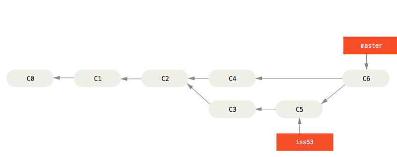

# 分支的新建与合并总结

> 让我们来看一个简单的分支新建与分支合并的例子，实际工作中你可能会用到类似的工作流。 你将经历如下步骤：
>
> 1. 开发某个网站。
> 2. 为实现某个新的用户需求，创建一个分支。
> 3. 在这个分支上开展工作。
>
> 正在此时，你突然接到一个电话说有个很严重的问题需要紧急修补。 你将按照如下方式来处理：
>
> 1. 切换到你的线上分支（production branch）。
> 2. 为这个紧急任务新建一个分支，并在其中修复它。
> 3. 在测试通过之后，切换回线上分支，然后合并这个修补分支，最后将改动推送到线上分支。
> 4. 切换回你最初工作的分支上，继续工作。

1. 假设现在 `master` 分支已经开展了一些工作了，现在有一个新的用户需求

2. 创建并切换到一个新的分支 `demand` 来做用户的需求

   ```bash
   git checkout -b demand 
   ```

   它是下面两条命令的简写：

   ```bash
   git branch demand 
   git checkout demand 
   ```

3. 随着工作的进展向前推进，这个分支上已经有了一些提交

   ```bash
   git add .
   git commit -m 'update'
   ```

4. 现在，突然有一个bug要你紧急修复。你所要做的仅仅是切换回 `master` 分支并新建一个 `issue` 分支去处理这个问题。但是，在你这么做之前，要留意你的工作目录和暂存区里那些还没有被提交的修改， 它可能会和你即将检出的分支产生冲突从而阻止 Git 切换到该分支。 最好的方法是，在你切换分支之前，保持好一个干净的状态（可以使用暂存（stashing） 和 修补提交（commit amending））。

   切换到 `master` 分支。

   ```bash
   git checkout master
   ```

   请牢记：当你切换分支的时候，Git 会重置你的工作目录，使其看起来像回到了你在那个分支上最后一次提交的样子。

5. 接下来，你要修复这个紧急问题，新建一个 `issue` 分支，在该分支上工作直到问题解决

   创建并切换到 `issue` 分支

   ```bash
   git checkout -b issue
   ```

   进行工作并提交

   ```bash
   git add .
   git commit -m 'update'
   ```

6. 工作完成后，合并 `issue` 分支到 `master` 上

   ```bash
   git checkout master
   ```

   合并分支（在 `master` 分支上）

   ```bash
   git merge issue
   ```

   当你试图合并两个分支时， 如果顺着一个分支走下去能够到达另一个分支，那么 Git 在合并两者的时候， 只会简单的将指针向前推进（指针右移），因为这种情况下的合并操作没有需要解决的分歧——这就叫做 “快进（fast-forward）”。现在，最新的修改已经在 `master` 分支所指向的提交快照中，你可以着手发布该修复了。

7. 关于这个紧急问题的解决方案发布之后，你准备回到被打断之前时的工作中。 然而，你应该先删除  `issue` 分支，因为你已经不再需要它了 —— `master` 分支已经指向了同一个位置。 你可以使用带 `-d` 选项的 `git branch` 命令来删除分支：

   ```bash
   git branch -d issue
   ```

8. 现在你可以切换回你正在工作的分支继续你的工作

   ```bash
   git branch demand
   ```

   你在 `issue` 分支上所做的工作并没有包含到 `demand` 分支中。 如果你需要拉取 `issue` 所做的修改，你可以使用 `git merge master` 命令将 `master` 分支合并入 `demand` 分支，或者你也可以等到 `demand` 分支完成其使命，再将其合并回 `master` 分支。

9. 假设你已经做完了用户的需求，并且打算将你的工作合并入 `master` 分支。 为此，你需要合并 `demand` 分支到 `master` 分支，这和之前你合并 `issue` 分支所做的工作差不多。 你只需要检出到你想合并入的分支，然后运行 `git merge` 命令：

   ```bash
   $ git checkout master
   Switched to branch 'master'
   $ git merge demand
   Merge made by the 'recursive' strategy.
   index.html |    1 +
   1 file changed, 1 insertion(+)
   ```

   这和你之前合并 `issue` 分支的时候看起来有一点不一样。 在这种情况下，你的开发历史从一个更早的地方开始分叉开来（diverged）。 因为，`master` 分支所在提交并不是 `demand` 分支所在提交的直接祖先（此时就产生**冲突**了，换言之，冲突产生的原因就是因为有人在除你自身分支和`master`分支外的其他分支上做了修改，而导致你自身分支的直接祖先已经有了新的版本，不能简单地通过将指针向前推进来到达你自身所在的分支，然后当你想要合并的到 `master` 分支上，就必须处理冲突），Git 不得不做一些额外的工作。 出现这种情况的时候，Git 会使用两个分支的末端所指的快照（`C4` 和 `C5`）以及这两个分支的公共祖先（`C2`），做一个简单的三方合并（把`C4` 和 `C5` 和 `C2` 进行简单合并）。

   

   和之前将分支指针向前推进所不同的是，Git 将此次三方合并的结果做了一个新的快照（`C6`）并且自动创建一个新的提交指向它。 这个被称作一次**合并提交**，它的特别之处在于他有不止一个父提交（有`C4` 和 `C5` 两个）。

   

   既然你的修改已经合并进来了，就不再需要 `demand` 分支了。 现在你可以在任务追踪系统中关闭此项任务，并删除这个分支。

   ```bash
    git branch -d demand
   ```

10. 如果你对 `issue` 分支上问题的修改和有关 `demand` 分支的修改都涉及到同一个文件的同一处，在合并它们的时候就会产生合并冲突：此时 Git 做了合并，但是没有自动地创建一个新的合并提交。 Git 会暂停下来，等待你去解决合并产生的冲突。 你可以在合并冲突后的任意时刻使用 `git status` 命令来查看那些因包含合并冲突而处于未合并（unmerged）状态的文件。

    ```bash
    $ git status
    On branch master
    You have unmerged paths.
      (fix conflicts and run "git commit")
    
    Unmerged paths:
      (use "git add <file>..." to mark resolution)
    
        both modified:      index.html
    
    no changes added to commit (use "git add" and/or "git commit -a")
    ```

    任何因包含合并冲突而有待解决的文件，都会以未合并状态标识出来。 Git 会在有冲突的文件中加入标准的冲突解决标记，这样你可以打开这些包含冲突的文件然后手动解决冲突。 出现冲突的文件会包含一些特殊区段，看起来像下面这个样子：

    ```html
    <<<<<<< HEAD:index.html
    <div id="footer">contact : email.support@github.com</div>
    =======
    <div id="footer">
     please contact us at support@github.com
    </div>
    >>>>>>> demand:index.html
    ```

    这表示 `HEAD` 所指示的版本（也就是你的 `master` 分支所在的位置，因为你在运行 merge 命令的时候已经检出到了这个分支）在这个区段的上半部分（`=======` 的上半部分），而 `demand` 分支所指示的版本在 `=======` 的下半部分。 为了解决冲突，你必须选择使用由 `=======` 分割的两部分中的一个，或者你也可以自行合并这些内容。

    在你解决了所有文件里的冲突之后，对每个文件使用 `git add` 命令来将其标记为冲突已解决。 一旦暂存这些原本有冲突的文件，Git 就会将它们标记为冲突已解决。

    ```bash
    git add .
    ```

    等你退出合并工具之后，Git 会询问刚才的合并是否成功。 如果你回答是YES，Git 会暂存那些文件以表明冲突已解决： 你可以再次运行 `git status` 来确认所有的合并冲突都已被解决：

    ```bash
    $ git status
    On branch master
    All conflicts fixed but you are still merging.
      (use "git commit" to conclude merge)
    
    Changes to be committed:
    
        modified:   index.html
    ```

    如果你对结果感到满意，并且确定之前有冲突的的文件都已经暂存了，这时你可以输入 `git commit` 来完成合并提交。 默认情况下提交信息看起来像下面这个样子：

    ```bash
    Merge branch 'demand'
    
    Conflicts:
        index.html
    #
    # It looks like you may be committing a merge.
    # If this is not correct, please remove the file
    # .git/MERGE_HEAD
    # and try again.
    
    
    # Please enter the commit message for your changes. Lines starting
    # with '#' will be ignored, and an empty message aborts the commit.
    # On branch master
    # All conflicts fixed but you are still merging.
    #
    # Changes to be committed:
    # modified:   index.html
    ```
